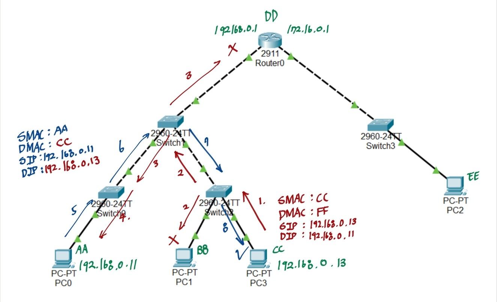

# 개요
> ARP(Address Resolution Protocol)는 **IP 주소를 기반으로 해당 장치의 MAC 주소를 찾는 프로토콜**이다.
- 네트워크에서 통신하려면 **MAC 주소가 필요**하므로, IP 주소만 알고 있는 경우 ARP를 사용하여 **MAC 주소를 조회**한다.
- 통신을 시도할 때 기본적으로 ARP를 통해 프레임을 전달할 곳의 MAC 주소를 조회하지만, MAC Table을 조회하여 저장된 MAC 주소가 있는 경우 따로 ARP를 보내지 않는다.


# ARP의 동작 원리


## ARP Request (MAC 주소 요청)
> 송신 장치가 대상 장치의 **MAC 주소를 모를 경우, 네트워크 전체에 ARP 요청을 브로드캐스트로 전송**하여 전체 장비에 요청하는 것을 의미한다. 같은 네트워크 상에 도착지 IP가 할당 된 MAC 주소가 있는지 요청을 보낸다.

예시)
- PC3 (192.168.1.13)가 PC1(192.168.1.11)에게 패킷을 보내려 함
- A는 B의 MAC 주소를 모름 → **ARP Request 전송**
- 브로드캐스트(FF:FF:FF:FF:FF:FF)로 "192.168.1.11 손들어" 요청

## ARP Reply (MAC 주소 응답)
> ARP 요청을 받은 장치는 **자신의 MAC 주소를 응답(ARP Reply)으로 전송** 응답은 **Unicast(1:1) 방식**으로 요청을 보낸 장치에게만 전송

예시)
- PC1(192.168.1.11)는 요청을 받고 자신의 MAC 주소를 SourceMAC에 담아 PC 3에게 전달
- PC3는 PC1의 MAC 주소를 **ARP 테이블(캐시)에 저장**하여 이후 요청 시 ARP를 반복하지 않음


# ARP 테이블 (ARP 캐시)
- MAC 주소 조회의 반복을 방지하기 위해 ARP 응답 결과를 일정 시간 동안 저장하는 메모리 공간
- `arp -a` 명령어를 사용하면 현재 저장된 ARP 테이블을 확인할 수 있다.
- `arp -d <ip>` 명령어를 통해 특정 ip 혹은 전체 ip에 대한 MAC 주소를 삭제할 수 있다.

**예시 (Windows/Linux에서 `arp -a` 실행 결과)**
```
인터넷 주소        물리적 주소           유형  
192.168.1.1       00-14-22-01-23-45    동적  
192.168.1.20      00-16-35-98-76-54    동적  
```

- **정적(Static) ARP**: 사용자가 직접 등록한 MAC 주소 (삭제 전까지 유지)
- **동적(Dynamic) ARP**: 네트워크 통신 중 자동 등록된 MAC 주소 (일정 시간이 지나면 삭제)


---
# 참고문헌

- 

---
# 연결문서

- 