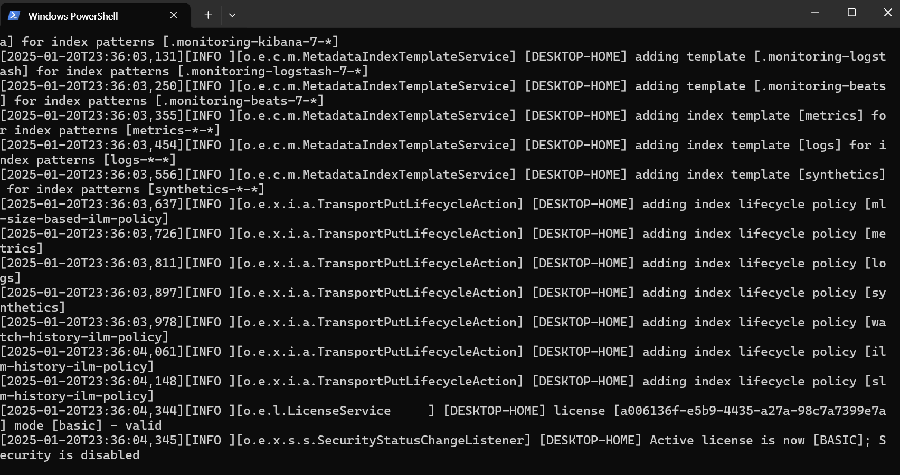

---
tags:
  - ELK
  - BigData
---
# ElasticSearch란?
ElasticSearch는 분산형 RESTFul 검색 및 분석엔진으로, 빠르고 유연한 검색과 분석 기능을 가진 도구이다. 현재 ELK 스택(ElasticSearch, Logstash, Kibana)에서 핵심 구성요소이며, 실시간 데이터 검색과 분석에 많은 기업들에서 채택하고 있다.

---

# 개념
## ElasticSearch의 구조
ElasticSearch는 ``_doc`` 즉 문서단위로 데이터를 저장한다. 모든 문서는 JSON 형식으로 표현되고 있으며, 다음과 같은 구조를 가진다.
> 클러스터(Cluster) : ElasticSearch 인스턴스의 집합, 데이터를 분산 저장하고 처리한다.
> 노드(Node) : 클러스터를 구성하는 각각의 서버
> 인덱스(Index) : 관련 문서들의 모음, DB 개념과 유사하다.
> 샤드(Shard) : 데이터를 분할하여 저장하는 단위, 검색 성능을 최적화한다.

## 주요 기능
> 빠른 검색 : 역색인 방식을 사용해 대량의 데이터를 실시간으로 검색해볼 수 있다.
> 분석 : 다양한 데이터 분석 기능을 제공하고 ELK Stack 중 Kibana를 통해 시각화할 수 있다.
> 확장성 : 수평확장을 지원하고 클러스터 내에서 자동으로 부하를 분산한다.
> RESTful API: 표준 HTTP 요청을 통해 데이터를 쉽게 검색하고 관리할 수 있다.
> 분산 아키텍처: 대용량 데이터 처리에 적합하며, 자동 복구 및 고가용성을 지원한다.

---

# RDBMS와의 차이
| 구분 | ElasticSearch | RDBMS |
| :-- | :-- | :-- |
| 데이터 구조 | JSON 문서 기반 | 테이블, 행, 열 기반 |
| 확장성 | 수평 확장 지원 | 수직 확장에 의존 |
| 검색 성능 | 텍스트 기반 고속 검색 최적화 | 검색속도 상대적으로 느림 |
| Use Case | Log 분석, 검색엔진, 비정형 데이터 | 금융 거래, 정형 데이터 관리 |

---

# ElasticSearch 설치 및 실행
[[ ELK Stack ] ElasticSearch 7.11.1 Archive link](https://www.elastic.co/downloads/past-releases/elasticsearch-7-11-1)


다운로드 및 압축 해제 후 CMD를 통해 다음과 같이 실행할 수 있다.
``` bash
$ cd [ 엘라스틱서치 폴더 경로 ]\bin

$ ./elasticsearch.bat
```



정상 실행 시에 브라우저를 통해 ``localhost:9200`` 접속해보면 json 데이터를 확인할 수 있다.


9200번 포트에 ElasticSearch가 실행중이고, 해당 포트에 RESTful API기능을 적극활용할 수 있도록 크롬 익스텐션이 존재한다. 이 툴을 이용해 데이터가 정상적으로 추가되었는지, 기본적인 조회와 데이터 삭제를 지원하니 유용하게 사용해보도록 하자.
