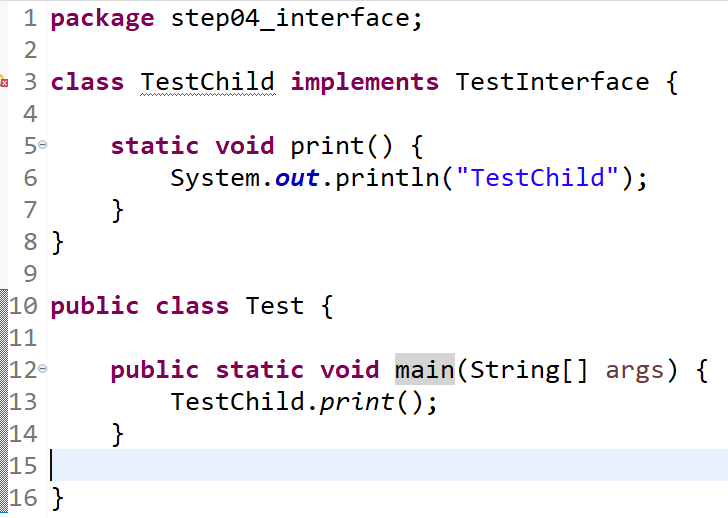
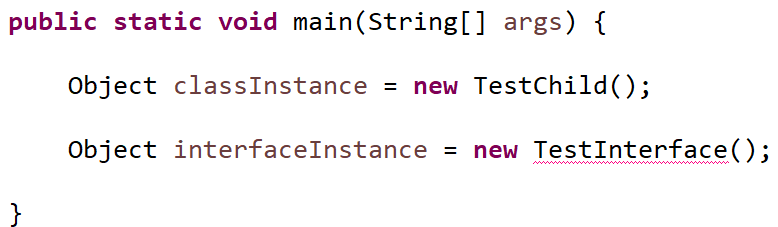
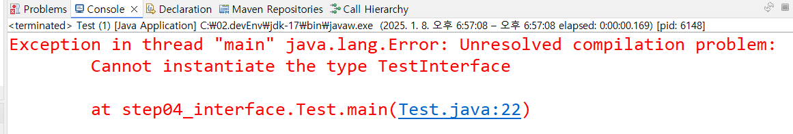

---
tags:
  - JAVA
---
Interface란 객체의 추상화와 오버라이딩, 상속 등을 이용하여 클래스의 명세와 기능을 분리하여 작성할 수 있도록 하는 역할을 한다.

예를들어서 10명의 개발자가 각각 클래스를 개발할 때 동일한 호출명과 리턴타입을 가진 메소드를 작성하기 위한 명세 즉 제한이 없을 경우 각자의 코딩 스타일과 부여받은 컨벤션에 따라 다른 방식으로 메소드를 작성할 가능성이 존재한다.

이때 Interface를 생성하여 클래스를 개발할때 명세 즉 반드시 필요한 메소드를 미리 정의하고 생성한 클래스에 주입관계를 명시함으로써 재정의해야하는 메소드에 대해 명시적으로 제한할 수 있다.

---

# 문법
## interface 생성

``` java
public interface InterfaceName {

}
```

## 상수 선언

``` java
public static final Type varName = ... ; 
```

> interface 내에 선언된 상수는 타입과 변수명만 작성해도 public static final이 자동으로 적용된다.

## 메소드 명세 작성

``` java
public abstract ReturnType methodName(); 
```

> 기본적인 메소드 작성법과 다르지 않지만 {}를 사용하지 않음으로써 메소드를 미완성 상태로 작성한다.

## 하위 클래스에서 interface 주입
``` java
public class ClassName implements InterfaceName {
	
}
```


## 하위 클래스에서 메소드 기능 작성
``` java
	@Override
 	public abstract ReturnType methodName() {
		// todo: 기능 구현 파트
		return null;
	}
```
> 메소드 overriding 문법과 같다.

---

# 예시

``` java
public interface TestInterface {
	String getValue();
}
```

interface로 정의한 TestInterface는 주입관계에 있는 클래스에서 재정의할 메소드로 getValue()와 toString()을 명세하고 있다. 이때 {}를 작성하지 않는 것은 해당 클래스의 반환타입과 재정의시 사용할 호출명, 메소드에 필요한 인자값만 먼저 작성하고 타 클래스에서 재정의할때 {}내의 기능 수행 면을 작성하도록 명세와 기능 작성을 분리하는 효과를 가진다.



위 코드를 실행해본 결과 TestInterface를 주입한 TestChild 클래스는 컴파일 혹은 런타임 중 에러가 발생하진 않았다. 다만 IDE 내에서 해당 클래스가 interface를 주입받았으며 명세로 작성된 메소드가 재정의 되지 않았다는 문제를 제기하는 것을 확인할 수 있다.

``` java
@Override
public String getValue() {
	// TODO getValue()에 대한 기능 구현
	return null;
}
```

따라서 TestChild 내에 getValue()를 오버라이딩 하는 것으로 해당 문제를 해결할 수 있다.

---

# 번외

class가 객체화 즉 인스턴스를 생성하는 것처럼 interface도 인스턴스 생성이 가능할까?




interface는 객체 생성이 불가한 타입이라고 한다. 하위클래스의 명세를 작성하는 목적에 맞게 사용해야한다. 다만 객체 생성은 불가하지만 추상화 클래스와 동일하게 객체의 타입으로 선언은 가능한 것을 확인해볼 수 있다.

``` java
TestInterface classInstance = new TestChild();
System.out.println(classInstance);

// step04_interface.TestChild@4517d9a3
```

이를 통해 TestInterface 타입의 classInstance 객체는 TestChild 영역의 주소값을 가진 것을 알 수 있다. 이는 객체의 다형성으로 인해 타입은 TestInterface 이지만 저장되는 메모리 상 위치는 하위 클래스인 TestChild 영역임을 볼 수 있다. 