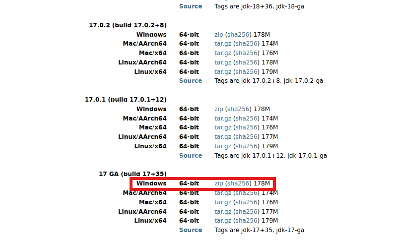
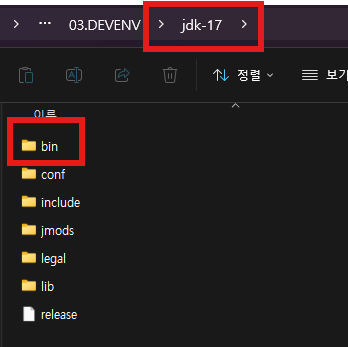
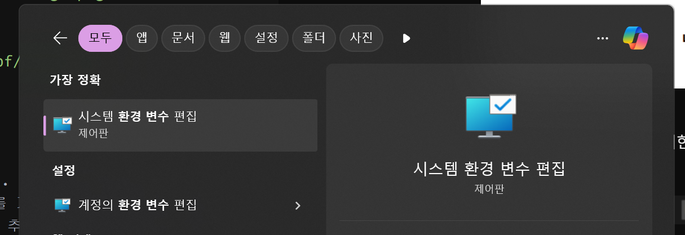
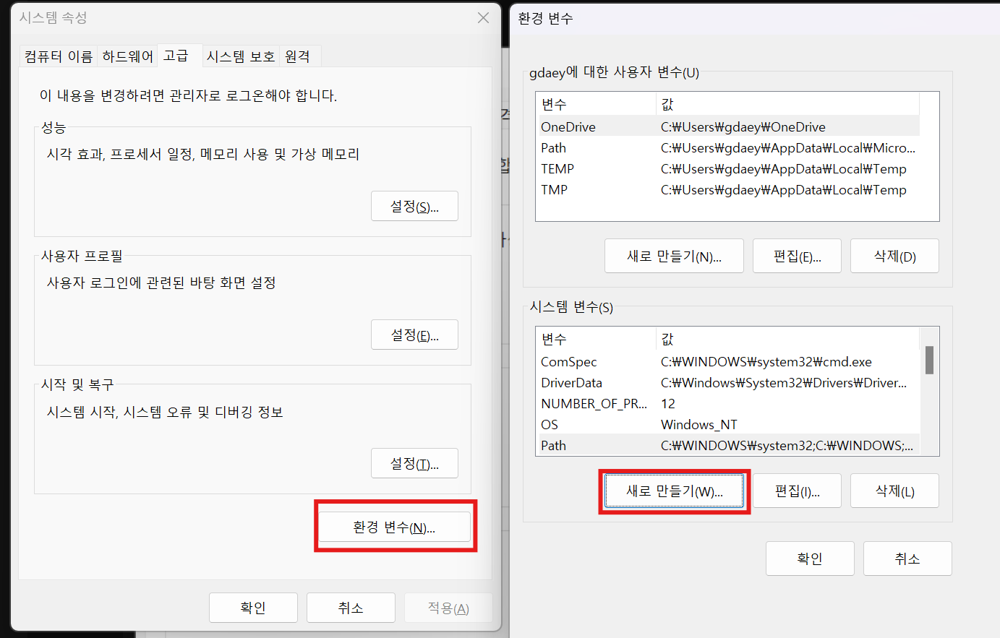
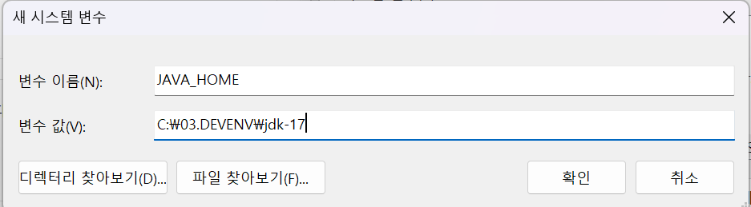
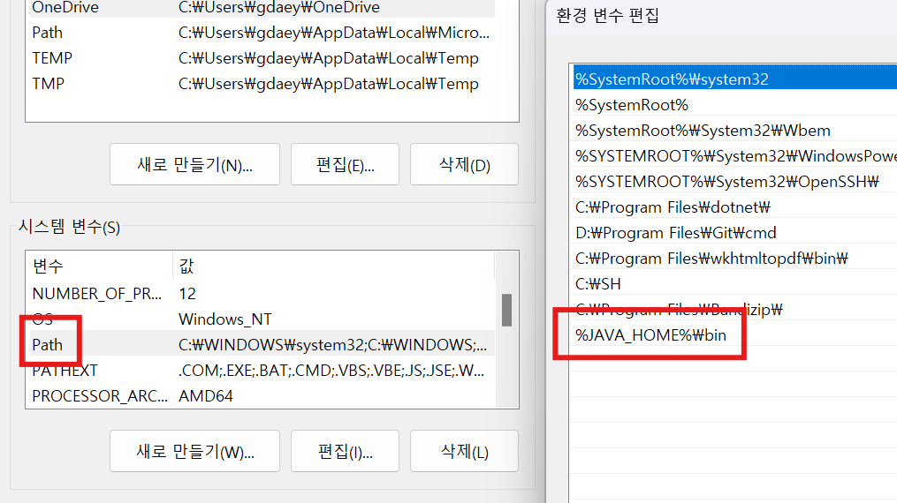
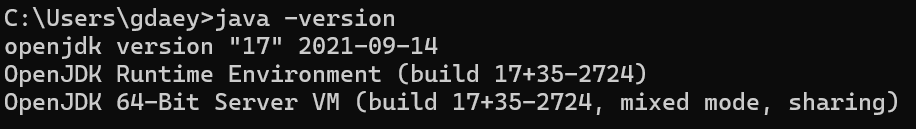

---
tags:
  - JAVA
---
# JDK란?
JDK는 JAVA DEVELOPMENT KIT의 약자로 JAVA 언어를 기반으로 컴파일러를 비롯해 개발에 필요한 도구와 JRE(JAVA RUNTIME ENVIRONMENT: 자바 실행 환경)을 제공한다. JDK는 크게 ORACLE JDK 버전과 OPEN JDK 버전으로 나누어져 있다. 기능에 일부 차이는 있지만 혹시 모를 라이센스 비용을 고려하여 이번에는 OPEN JDK를 설치해보는 시간을 가져보자.

# OPEN JDK 17 다운로드
[OPEN JDK 17 ARCHIVE](https://jdk.java.net/archive/)
새로운 버젼이 많이 출시되었지만 현재까지 많은 기업들에서 적용하는 만큼 안정성이 보장된 17버젼으로 진행해보자.

JDK 17 GA 버전을 OS에 맞게 설치 한후 압축을 해제한다.

# 환경변수 설정
환경변수 설정에 앞서서 압축 해제한 폴더명을 등록과 식별의 편의성을 위해 ``jdk-17``로 변경해 두자. 등록할 변수 중 ``JAVA_HOME``이란 JAVA 기반 소프트웨어 실행 시에 java 실행 파일이 위치한 bin 디렉토리의 주소를 가리키는 변수로 설치 초기에 지정해두고 JAVA 컴파일러 혹은 JAVA 실행파일을 해당 위치에서 실행시킬 수 있도록 path를 잡아준다. 추후 JDK 버전에 따라 호환되지 않는 소프트웨어를 실행 시킬 때 적절히 해당변수를 변경해가며 원하는 버전의 JDK를 상황에 맞게 셋팅할 수 있다.

1. ``JAVA_HOME`` 등록
jdk-17 폴더 내에 java 실행 파일이 존재 하는 ``bin`` 폴더가 있는 위치에서 해당 path를 복사한다.

``JAVA_HOME`` 변수를 등록했다면 다음과 같이 PATH를 추가해주자.

# 설치 확인
설치 확인을 위해서 cmd 창을 열고 다음과 같이 ``$ java -version``을 입력하여 설치한 JDK 버전 정보가 잘 출력 되는지 확인 하는 것을 잊지 말자! 

