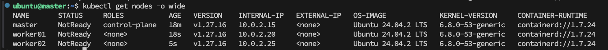

# 개요
> Kubernetes (k8s)는 컨테이너화된 애플리케이션을 **자동으로 배포, 스케일링, 운영**할 수 있도록 도와주는 **컨테이너 오케스트레이션 도구**이다.

## 사용 이유
>컨테이너 기술(Docker, containerd 등)이 등장하면서 **애플리케이션 배포**가 간편해졌지만, **대규모 운영**에서는 다음과 같은 문제점이 발생한다.

| 문제점           | 설명                               | Kubernetes의 해결 방법                     |
| ------------- | -------------------------------- | ------------------------------------- |
| **수동 배포 부담**  | 컨테이너를 여러 서버에 배포하려면 사람이 직접 설정해야 함 | 자동 배포 (`kubectl apply`)               |
| **부하 분산 문제**  | 특정 서버에 컨테이너가 몰리면 성능 저하 발생        | 로드 밸런싱 (`Service`, `Ingress`)         |
| **장애 복구 어려움** | 컨테이너가 비정상 종료되면 사람이 직접 재시작해야 함    | 자동 복구 (`ReplicaSet`, `Self-healing`)  |
| **확장성 부족**    | 트래픽 증가 시 컨테이너를 늘리는 작업이 복잡함       | 자동 스케일링 (`Horizontal Pod Autoscaler`) |

**Kubernetes는 위의 문제들을 해결하는 "자동화된 컨테이너 관리 도구"이다.**

# 주요 개념
## **1. Cluster**
> Kubernetes에서 클러스터는 여러 개의 노드(서버)로 구성되며, 컨테이너화 된 애플리케시션을 실행하고 관리하는 시스템이다.

## **2. Node**
> Kubernetes 클러스터에서 컨테이너를 실행하는 단위, 보통 물리적으로 분리된 각각의 서버를 의미한다. node는 목적에 따라 `Master`와 `Worker` 노드로 분리되며, `Master` 노드는 클러스터 내의 자원 관리를 `Worker` 노드는 실제 서비스 제공을 위해 운영된다.

## **3. Pod**
> 컨테이너의 실행 단위로, 하나 이상의 컨테이너를 포함할 수 있다.

## **4. Service**
> 클러스터 내에서 실행 중인 파드 간 혹은 외부 애플리케이션과의 네트워크 통신을 제공하는 객체이다. 각각의 Service는 ip를 가진다.

## **5. Deployment**
> 파드를 생성하고 관리하는 Kubernetes의 리소스로, 애플리케이션의 배포 및 롤링 업데이트를 담당한다. `Replicaset` 옵션을 통해 생성, 유지될 파드의 복제 계수를 설정할 수 있다.

## **계층구조**
- 클러스터 (노드를 묶어 하나의 클러스터로 구성)
	- 노드 (마스터-워커로 구분, 물리적 구분)
		- 네임스페이스 (개별 네트워크, 논리적 구분, 내부 서비스 이름으로 dns 기능 지원)
			- 디플로이먼트 (레플리카 셋 설정 가능 -> 파드의 개수 지정) 
				- 파드 (호스트, 동적 ip 할당)
	-  서비스 (파드의 게이트웨이)

# Kubernetes 클러스터 구성
## VM 3개 준비

| 구분       | H/W                      | IP        | Network           |
| -------- | ------------------------ | --------- | ----------------- |
| master   | p: 4개, ram: 4g, hdd: 20g | 10.0.2.15 | 10.0.2.0/24 (NAT) |
| worker01 | p: 2개, ram: 2g, hdd: 20g | 10.0.2.20 | 10.0.2.0/24 (NAT) |
| worker02 | p: 2개, ram: 2g, hdd: 20g | 10.0.2.25 | 10.0.2.0/24 (NAT) |

## 노드 별 공통 설정
### Containerd 설치 및 옵션 설정

**컨테이너 기반 실행환경 설치 (1, 2번 중 선택)** 
1. [Docker 설치방법](/Blog/Docker/Docker)
2. [Containerd 설치 방법](/Blog/Containerd/Containerd)

**kubernetes 도구 설치 (`kubelet` `kubeadm` `kubectl`)**
```bash
# 필요한 패키지 설치
sudo apt-get update
sudo apt-get install -y apt-transport-https ca-certificates 

# 새로운 Kubernetes 공식 GPG 키 다운로드
sudo mkdir -p /etc/apt/keyrings
curl -fsSL https://pkgs.k8s.io/core:/stable:/v1.27/deb/Release.key | sudo gpg --dearmor -o /etc/apt/keyrings/kubernetes-apt-keyring.gpg

# 저장소 추가
echo "deb [signed-by=/etc/apt/keyrings/kubernetes-apt-keyring.gpg] https://pkgs.k8s.io/core:/stable:/v1.27/deb/ /" | sudo tee /etc/apt/sources.list.d/kubernetes.list

# 저장소 활성화 옵션 추가
sudo tee /etc/apt/apt.conf.d/99allow-insecure-repositories <<EOF
APT::Get::AllowUnauthenticated "true";
Acquire::AllowInsecureRepositories "true";
Acquire::AllowDowngradeToInsecureRepositories "true";
EOF

# 업데이트 (인증 오류 무시)
sudo apt-get update --allow-unauthenticated

# 패키지 설치 (사용 가능한 버전 찾기)
sudo apt-get install -y --allow-unauthenticated kubelet kubeadm kubectl

# 패키지 설치 확인
kubectl version --client --output=yaml
kubeadm version --output=yaml
kubelet --version
```

**Container Network interface 설정 (calico 사용)**

```bash
kubectl apply -f https://docs.projectcalico.org/manifests/calico.yaml
```


## Master 노드 설정

```sh
# 인증서 만료 확인
sudo kubeadm certs check-expiration

# 필요한 Kubernetes 이미지 목록 조회
sudo kubeadm config images list
```

### CRI (Container Runtime Interface) 별 설정 
**Containerd 기반** 
```sh
# containerd를 사용하여 Kubernetes 이미지 다운로드
sudo kubeadm config images pull --cri-socket /run/containerd/containerd.sock	containerd 

# Master 노드 초기화
sudo kubeadm init \
	--apiserver-advertise-address=10.0.2.15 \
	--pod-network-cidr=192.168.0.0/16 \
	--cri-socket /run/containerd/containerd.sock
```

**Docker 기반**
```sh
# docker를 사용하여 Kubernetes 이미지 다운로드
sudo kubeadm config images pull --cri-socket unix:///run/cri-dockerd.sock

# Master 노드 초기화
sudo kubeadm init \
	--apiserver-advertise-address=10.0.2.15 \
	--pod-network-cidr=192.168.0.0/16 \
	--cri-socket unix:///run/cri-dockerd.sock
```

**Master Node Init Command Output**
> 아래 출력 내용을 복사 한 뒤 Worker 노드 설정 이후 클러스터로 편입 시에 활용한다.
```sh
$ mkdir -p $HOME/.kube 
$ sudo cp -i /etc/kubernetes/admin.conf $HOME/.kube/config 
$ sudo chown $(id -u):$(id -g) $HOME/.kube/config

kubeadm join 10.0.2.15:6443 --token gli4qd.tjgk0e8fpb2yby9r --discovery-token-ca-cert-hash sha256:50666dce0b3da6d4c5a90a73b7331e2b434dfdcd587284da4a394f59c0e33794
```

```sh
# 클러스터 초기화 이후 인증서 상태 재확인
sudo kubeadm certs check-expiration
```

**노드 상태 확인**
```sh
kubectl get nodes -o wide
```


## Worker 노드 설정

**Master 노드에서 저장한 k8s 설정을 Worker 노드로 가져오기**
```bash
scp -p ubuntu@master:~/.kube/config ~/.kube/config
```


**k8s 클러스터에 Worker 노드 조인**
```sh
kubeadm join 10.0.2.15:6443 --token gli4qd.tjgk0e8fpb2yby9r --discovery-token-ca-cert-hash sha256:50666dce0b3da6d4c5a90a73b7331e2b434dfdcd587284da4a394f59c0e33794
```


**노드 상태 재확인**
```sh
kubectl get nodes -o wide
```



---
# 참고문헌

- 

---
# 연결문서

- [Containerd](/Blog/Containerd/Containerd)
- [Docker]
- [Calico]