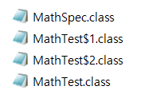
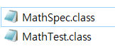

---
tags:
  - JAVA
---
# 개요
타 언어와 마찬가지로 Java에도 Lambda(람다)표현식이 존재한다. 람다 표현식은 코드를 더욱 간결하게 작성하고, 함수형 프로그래밍 스타일을 가능하게 해주는 기능이다. 주로 익명함수를 구현하는 데 사용된다.

전통적으로 메서드를 정의하고 호출할 때에는 클래스와 메서드를 명시적으로 작성해야 했지만 람다를 통해 이를 간략화 할 수 있다.

람다 표현식의 경우 다음과 같은 경우에서 주로 활용된다.
> 1. 이벤트 핸들러와 같은 콜백 함수 구현
> 2. 정렬, 필터링, 매핑과 같은 데이터 처리
> 3. 간단한 비동기 작업
> 4. 데이터 파이프라인 처리를 위한 Stream API와 조합

--- 

# 문법
## Lambda 표현식 작성
``` java
( parameter ) -> { function body }
```
표현법은 정말 간단하다. 인자를 받을 ()와 기능 구현을 위한 {}를 ->로 이어주기만 하면 된다. 여기서 함수 바디에서 단일 문장으로 구성된 경우 {}를 생략하여 작성이 가능하다.

## 예제
### 리스트 타입에서 요소 추출

``` java
List<People> peoples = Arrays.asList(
                          new People("p1", 10),
                          new People("p2", 20),
                          new People("p3", 30)
                       );
```
> 이러한 상태에서 ``peoples`` 변수에 할당된 ``People`` 인스턴스를 출력해보자.

#### 1. 일반적인 for문 사용
``` java
for (People people : peoples) {
	System.out.println(people);
}

/* 출력
People(name=p1, age=10)
People(name=p2, age=20)
People(name=p3, age=30)
*/
```

#### 2. .forEach() + Lambda
``` java
peoples.forEach(v -> System.out.println(v));

/* 출력
People(name=p1, age=10)
People(name=p2, age=20)
People(name=p3, age=30)
*/
```

#### 번외. .forEach() + 메소드 참조 표현식(::)
``` java
peoples.forEach(System.out::println);

/* 출력
People(name=p1, age=10)
People(name=p2, age=20)
People(name=p3, age=30)
*/
```

## Functional Interface
functinal interface란 interface 개발 시에 메소드의 기능을 동적으로 생성할 수 있도록 도와주는 개념으로 functional interface를 선언하는 방법은 interface 상단에 ``@FunctionalInterface`` 어노테이션을 작성하면 된다. 이때 주의할 점은 interface에서 정의할 추상 메소드는 **_1개로 한정된다는 점_**과 **_interface를 직접 주입하지 않는다는 점_**이다.

Functinal Interface를 활용하기 위한 문법은 예제와 함께 살펴보자.

## Functinal Interface 사용 예제
``` java
// MathSpec.java
@FunctionalInterface
public interface MathSpec {
	public abstract int operation(int v1, int v2);
}
```

``` java
// App.java.main()
MathSpec add = new MathSpec() {
	public int operation(int v1, int v2) {
		return v1 + v2;
	}
};
```
> 여기서 주목할 점은 interface 특성 상 상위 타입으로 지정할 수는 있지만 객체 생성이 되지 않는다는 점과 달리 ``new`` 생성자를 통해 객체를 생성함과 동시에 내부 메소드에 대한 내용을 작성한 것을 확인할 수 있다.
> 이는 클래스의 이름이 없이 인스턴스를 생성할 수 있으며 클래스 내의 클래스 Inner Class라고 한다. 

위방식으로 실행 후에 컴파일된 폴더 내부를 살펴보면 다음과 같이 구성되어 있다.

MathTest.class 파일과 더불어 이름 없이 생성되어 번호가 붙여진 MathTest$1~2가 생성된 것을 확인할 수 있다.

조금 더 코드를 줄이기 위해 Inner 클래스를 람다 표현식을 이용하여 작성할 수도 있는데 다음 코드를 살펴보자.
```java
// App.java.main()
MathSpec add = (v1, v2) -> v1 - v2;
```
이 경우에 앞서 소개한 방법에 비해 월등히 간단하게 구현됨을 알 수 있다. 인스턴스 생성을 위한 ``new``도 파라미터로 받을 인자의 타입도, 심지어 Return 키워드도 생략이 가능한 것을 알 수 있다.

이렇게 선언이 가능한 이유는 Functional Interface 내부에 존재할 수 있는 메소드를 1개로 한정 했기 때문이다. 인자의 개수, 타입, 반환 값이 이미 명시되어 있기때문에 짧은 람다 표현식 만으로도 처리가 가능하다.

``` java
// App.java.main()
MathSpec add = (v1, v2) -> v1 + v2;
System.out.println(add.operation(1, 2));
// 출력 : 3

MathSpec sub = (v1, v2) -> v1 - v2;
System.out.println(sub.operation(1, 2));
// 출력 : -1

MathSpec mul = (v1, v2) -> v1 * v2;
System.out.println(mul.operation(1, 2));
// 출력 : 2
```
> interface를 주입받은 클래스를 명시적으로 작성하지 않더라도 위와 같이 클래스 내부에서 즉각적으로 생성하여 사용할 수 있는 장점이 있다.

Lambda 표현식을 사용했을 때 컴파일된 폴더 내부를 살펴보자.

앞선 방식에서 확인한 것과 달리 Lambda 표현식을 사용해서 inner class를 구현했을 때 컴파일 된 클래스 파일이 존재하지 않는 것을 확인할 수 있다.