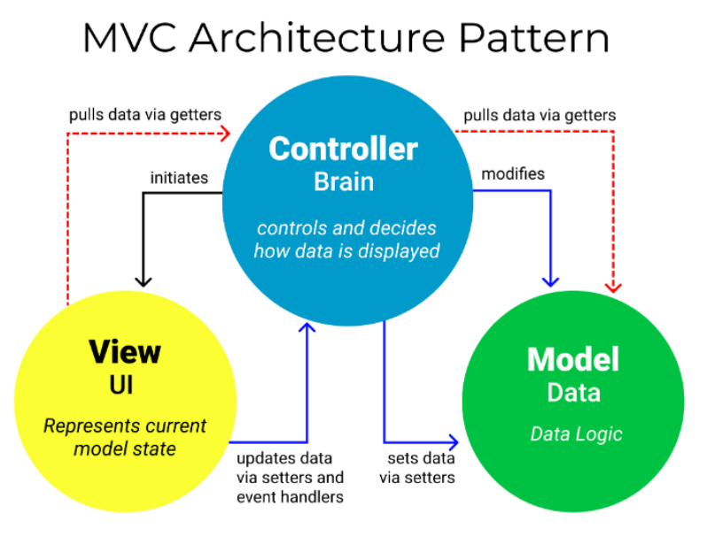

---
tags:
  - JAVA
  - Spring
---
MVC Pattern이란 Model-View-Controller의 약자로, 컴포넌트를 Model, View, Controller 역할로 구분하여 프로세스를 수행함에 있어 역할별 제한 사항을 지키도록 설계하여 효율적인 개발을 가능하게 하는 패턴을 의미한다.

컴포넌트 별로 수행하는 역할은 다음과 같다.

# Model
> 데이터 즉 비즈니스 로직 내에서 생성되거나 초기화 될 모든 정보와 데이터베이스 연동 등 서비스할 데이터의 가공을 담당하는 컴포넌트이다.
1. 사용자가 편집하길 원하는 모든 데이터를 가지고 있어야한다.
2. View나 Controller에 대해서 어떠한 정보도 몰라야한다.
3. 변경이 일어나면 변경 통지에 대한 처리를 구현해야한다.

# View
> 클라이언트에게 직접 노출되는 영역으로 클라이언트에 행동에 따라 이벤트를 발생시키고 요청된 정보를 화면에 표시하는 역할을 수행한다.
1. Model이 가지고 있는 정보를 따로 저장하지 않는다.
2. Model이나 Controller와 같이 다른 구성요소를 몰라야한다.
3. 변경이 일어나면 변경 통지에 대한 처리를 구현해야한다.

# Controller
> View에서 발생한 이벤트에따라 특정 요청을 Model로 전달하거나, Model로 부터 받은 응답을 View로 전달하는 역할을 수행한다.
1. Model이나 View에 대한 정보를 가지고 있어야 한다.
2. Model이나 View에 변경을 모니터링 해야한다.

---
# 참고자료
- https://m.blog.naver.com/jhc9639/220967034588

