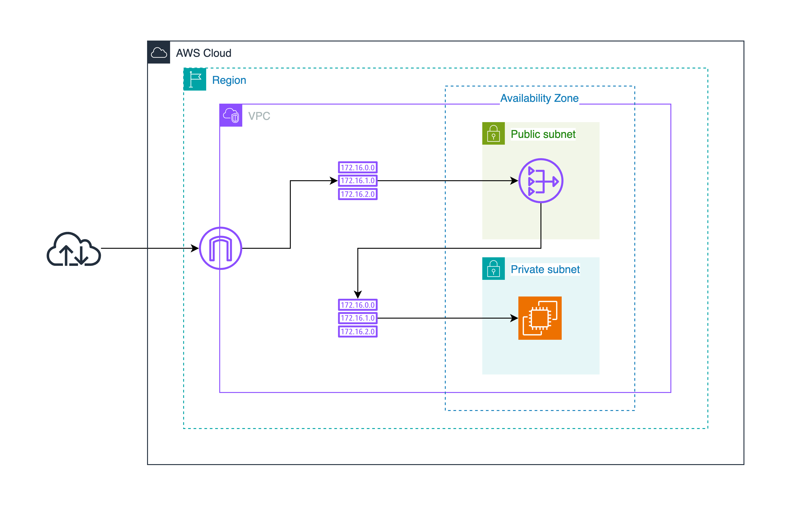

# 개요
> AWS에서 인스턴스를 생성할 때 목적에 따라 리소스를 프라이빗 서브넷에 위치시켜하 할 때가 존재한다. 이때 생성된 인스턴스에서는 인터넷과 모든 연결이 격리되어 있는 상태로 오직 같은 VPC 상에 존재하는 리소스 간 통신만 허용된 상태이다.


> [!fail] 결과적으로 ...
> 클라우드 내에 패키지 저장소가 없다면 패키지 설치 혹은 업데이트가 불가능한 문제가 생긴다.


# 해결방법
## 1. `NAT Gateway` 사용


## 2. Public subnet 내 인스턴스를 프록시로 사용
#### **프록시 적용 방법**
**public subnet 내 EC2**
```sh
sudo apt update
sudo apt install apt-cacher-ng -y
```
> 인바운드 규칙 `<private-subnet-network>:3142` 추가

**private subnet 내 EC2**
```sh
proxy로 사용할 public EC2 ip 설정
echo 'Acquire::http { Proxy "http://<public-ec2>:3142"; };' | sudo tee /etc/apt/apt.conf.d/01proxy
```

#### **프록시 설정 해제 방법**
**public subnet 내 EC2**
캐쉬 초기화
```sh
sudo systemctl stop apt-cacher-ng
sudo rm -rf /var/cache/apt-cacher-ng/*
sudo systemctl start apt-cacher-ng
```

**private subnet 내 EC2**
프록시 비활성화
```sh
sudo rm /etc/apt/apt.conf.d/01proxy
```


## 방법 별 장단점 비교

|항목|NAT Gateway|프록시 중계 서버|
|---|---|---|
|**설정 편의성**|매우 쉬움|복잡|
|**비용**|비교적 높음|트래픽 적으면 저렴|
|**성능**|자동 확장|수동 확장|
|**가용성**|멀티 AZ로 구성 가능|EC2 기반이므로 직접 구성 필요|
|**보안 제어**|제한적|세밀한 정책 적용 가능|
|**로깅**|별도 설정 필요 (VPC Flow Logs 등)|로그 설정 가능 (예: Squid 로그)|
|**운영 관리**|거의 없음 (AWS가 관리)|직접 관리 필요|


---
# 참고문헌

- 

---
# 연결문서

- 