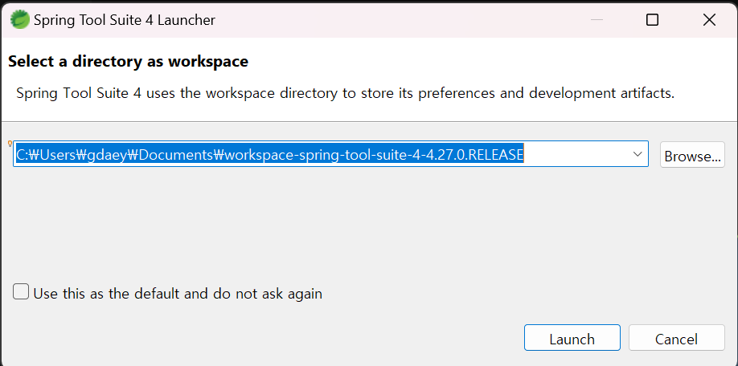

---
tags:
  - JAVA
  - Spring
  - STS
---
이전 포스트에서 작성한 JDK 17 버전이 설치가 되었다면 IDE를 설치해보자. Java, Spring 개발을 위한 주로 채택되는 IDE는 InteliJ, Eclipse가 있다. Path 설정과 라이브러리 세팅, gradle, maven 프로젝트 생성 등 개발자의 편의성 측면에서 InteliJ를 이길 순 없지만 비싸다. InteliJ를 채택하는 기업도 있지만 비용적 측면에서 우리에겐 많은 기업에서 많이 사용되는 무료로 제공되는 Eclipse가 있지 않나. Eclipse도 여러 버전이 있지만 국내 최다 사용되는 Spring을 Eclipse을 통해 개발 할 수 있도록 만들어준 Spring Tools(elipse)를 설치해보자.

# Spring Tools 다운로드
[Spring tools 4 다운로드 링크](https://spring.io/tools)


OS에 맞는 버전을 다운로드 받은 후 압축을 해제하면 다음과 같이 구성되어 있다.


해당 파일을 실행하고 워크스페이스를 설정해보자.




sts를 실행하면 다음과 같은 화면이 출력된다. 내 경우에 UI 배율이 너무 작아서 UI크기를 조절해보겠다.


sts 폴더 내의 SpringToolSuite4.ini 파일 제일 하단에 다음 내용을 추가하고 ``Dswt.autoScale`` 값을 조절하여 보기 편한 정도로 조절해보자. 내경우에는 ``Dswt.autoScale=180``으로 설정하는게 제일 보기 좋았다.
```
-Dswt.enable.autoScale=true
-Dswt.autoScale=100
-Dswt.autoScale.method=nearest
```