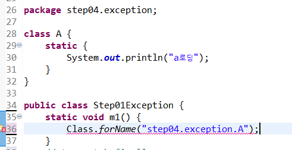
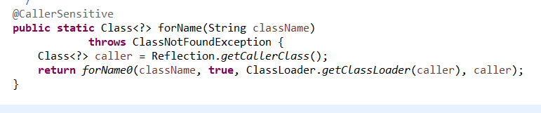
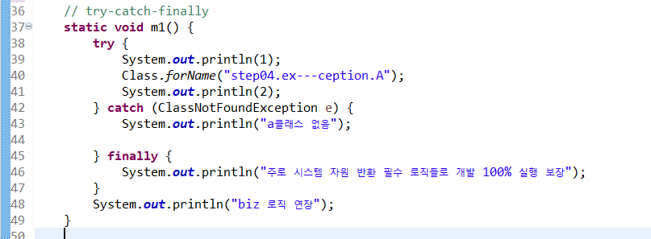
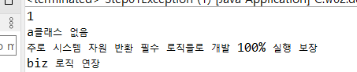
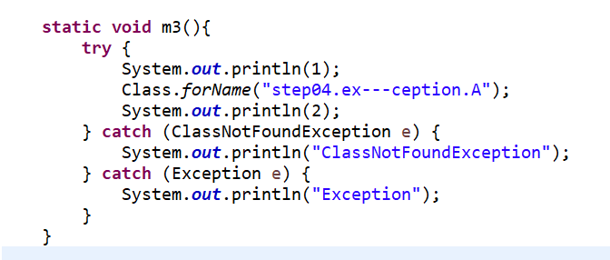
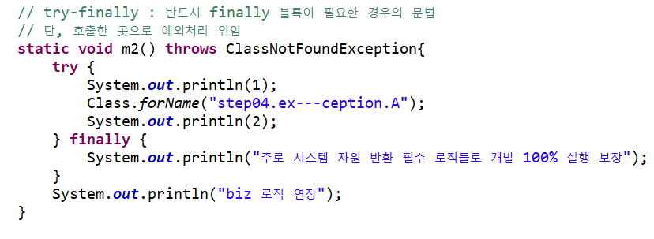
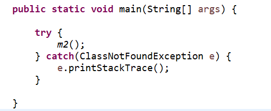

---
tags:
  - JAVA
---
# 개요
>언어마다 표기하는 문법은 조금씩 차이가 있지만 Try-Catch 문을 사용하는 목적은 동일하다.의도하지 않은 에러가 발생함으로써 프로그램 실행 중에 중단되는 것을 막기위해 에러가 발생할 가능성이 있는 구문을 넣고 실제로 해당구문에서 에러가 발생했다면 Catch문 내의 코드를 통해 Exception 처리와 에러 시 반환 값이 있을 경우 관련 처리를 Finally문으로 가능하게 하는 문법이다.

# 에러의 종류
처리 가능한 에러의 종류는 크게 두 가지로 볼 수 있다.
1. 컴파일 에러
2. 런타임 에러

## 컴파일 에러
컴파일 에러의 경우 .java 형태의 파일을 byte 코드로 변환할 때에 문법적인 오류가 있진 않지만 프로그램 실행 안정성을 보장하지 못해 발생하는 에러이다. 예시를 보자.



```java
Class.forName()
```

위 메소드는 `packageName.ClassName`을 인자로 받아 해당 클래스를 찾아 반환하는 역할을 한다. 문법적으로 오류가 없지만 컴파일 시키지 못하고 에러를 발생시키는 원인에 대해 살펴보자.



Class 패키지에 정의된 `forName()` 메소드는 인자로 `className`을 받지만 해당 메소드에서 에러가 발생하면 `ClassNotFoundException`을 호출한 곳으로 에러 처리를 위임한 것을 확인할 수 있다.

> 즉 `forName` 메소드를 사용하기 위해서는 `ClassNotFoundException`을 처리해 줘야 한다.

## 런타임 에러





위와 같이 작성하면 컴파일 에러는 발생하지 않는다. 하지만 클래스 명을 잘못 기입함으로써 런타임 에러가 발생하였고 catch, finally문을 차례대로 실행하는 것을 확인할 수 있다.

# 문법
## `Try` - `Catch` - `Finally` 문
```java
try {
 		// 비즈니스 로직
 } catch(발생되는 예외 타입의 변수) {
 		// 발생된 예외 처리 블록
 } finally {
		// 자원반환과 같은 필수 코드 구현 영역
 		// 100% 실행 보장.
 }
```

## 다중 `Catch` 문
`Catch`문의 경우에 `Exception` 객체의 종류 별로 처리 방식을 다르게 처리할 수 있다.



> 위와 같이 `try`문에서 `ClassNotFoundException`이 발생했을 때와 `Exception`이 발생했을 때 에러 객체의 종류 별로 매핑하여 다른 처리 과정을 수행하도록 처리가 가능하다.

## `Try` - `Finally` 문
`Try-Finally`문의 경우 `Catch`문을 통해 에러 객체를 잡아낼 수는 없지만 프로세스의 특성 상 `finally`문의 사용이 불가피할 경우 사용할 수 있다.



> 단 메소드 명 뒤에 `throws ClassNotFoundException`을 표기함으로써 해당 메소드를 호출한 곳으로 `ClassNotFoundException`의 처리를 위임하도록 작성해야 문법 오류가 발생하지 않는다.

이 경우 `Class.forName()` 메소드와 동일하게 호출할 메소드 위치에서 `try`-`catch`문을 이용해 에러 객체의 처리를 수행해야 한다.



에러 처리의 위임을 통해 목적에 따라 특정 컴포넌트에 예외 처리를 모아 코드의 가시성을 높일 수 있다.