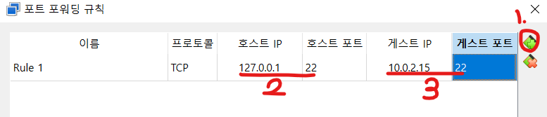

---
tags:
  - OS
  - Ubuntu
  - VM
  - Linux
---
# 운영체제 설정
사용하는 컴퓨팅 리소스에 맞게 설정 후 이미지 설치를 진행한다.


초기 이미지 설치 이후 터미널이 활성화 되면 할 일은 다음과 같다.
1. 서버 시간대 조정
2. ssh 설정
    a. OpenSSH 설치
    b. NAT 설정
    c. 접속 확인

---
# 서버 시간대(Time - zone) 설정


현재 local time으로 설정된 시간대는 time zone이 Etc/UTC이다. 한국의 경우 시차를 적용하기 위해 Asia/Seoul 시간대로 변경할 필요가 있다.

```bash
// 현재 설정된 서버 시간 상태 출력
timedatectl
timedatectl status
```

```bash
// 설정 가능한 time zone 출력
timedatectl list-timezone
```

``` bash 
// 서버에 적용할 time zone 설정
sudo timedatectl set-timezone <time-zone-name>
sudo timedatectl set-timezone Asia/Seoul
```
  
적용후 반드시 변경내용 확인을 위해 status를 찍어보자!


# SSH 설정
#### openssh 설치

```bash
// 패키지 apt update는 필수
sudo apt update
```

```bash
// openssh-server 설치
sudo apt install openssh-server 
```
  
```bash
// 서비스 액티브 상태 조회
service ssh status
```
  
```bash
// 서비스 실행
service ssh start
```
  


설치 이후 서비스 액티브 상태를 조회 해본 결과 죽어있다면 다음과 같이 서비스를 다시 실행시켜서 상태조회를 해보자.


서비스 상태가 active가 출력된다면 준비는 완료되었다!

# ssh설정

외부 리소스에서 우분투 컨테이너로 접근하려면 포트포워딩이 필요하다. 이를 위한 ip를 조회해보자

```bash
ip a
```


2번 항목에 inet이 외부에서 접근할때 사용할 ip 주소를 보여준다. 여기서는 10.0.2.15를 사용하면 된다.

window에서 접근할때는 [localhost](http://localhost) 즉 127.0.0.1 에서 ubuntu 컨테이너의 ip 주소인 10.0.2.15:22번 포트를 사용해 포트포워딩을 진행하면 된다.


2번 NAT가 잘 설정되었는지 확인 후 포트포워딩을 진행한다. 



2번은 윈도우의 [localhost](http://localhost) 주소를 3번은 연결할 ubuntu 컨테이너의 ip주소와 포트 번호를 설정한다.

# ssh 연결 확인
ssh연결 확인을 위해서 mobaxterm이라는 툴을 사용해보자.
접속 후 session을 생성한다.


ssh 설정이 잘 되었다면 위와 같이 ubuntu 리소스에 접속이 가능할 것이다.