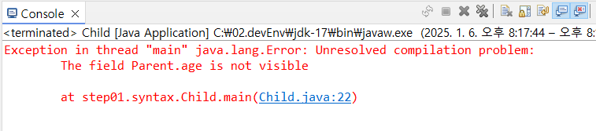

---
tags:
  - JAVA
---
# 상속
타 클래스를 상속 받아 만들어진다는 것은 쉽게 설명해서 부모 클래스의 변수와 메소드만들 재사용 가능하게끔 공유 받는 것을 의미한다.

## 문법
``` java
class Child extends Parent([args]) {}
```

>`Child` 클래스는 `Parent` 클래스를 상속받아 따로 작성하지 않아도 `Parent` 클래스의 작성된 변수와 메소드를 사용할 수 있다.

## 예제
``` java
class Parent {
	String name = "철수";
	private int age = 25;
	public void printName() {
		System.out.println(name);
	}
	public void printAge() {
		System.out.println(age);
	}
}

public class Child extends Parent {
	
	public static void main(String[] args) {
		Child c = new Child();
		c.printName();
		c.printAge();
	}

}
```

출력: 
``` 
철수
25
```

`Child` 클래스에서는 `printName()`, `printAge()` 메소드를 정의 하지 않았지만 상속 받은 `Parent` 클래스에 정의된 메소드를 사용할 수 있는 것을 확인할 수 있다.

메소드 이외에도 변수도 동일하게 적용되는지 살펴보자.


``` java
public Static void main([args]) {
	Child c = new Child();
	System.out.println(c.name);
	System.out.println(c.age);
}
```



`c.age`를 출력하려고 보니 `Parent` 클래스에서 `age` 변수가 `private`로 정의되어 있어 해당 오류가 발생한다. 즉 부모 클래스로부터 모든 변수와 메소드를 상속 받는 것이 아닌 `private`로 접근이 제한된 변수 혹은 메소드는 아무리 상속 관계여도 제공되지 않는 것을 볼 수 있다.

# 다형성
다형성이란 객체지향프로그래밍(OOP)에서 하나의 객체가 여러가지 타입을 가질 수 있는 것을 의미한다. `Java.util.lang.Object` 클래스는 모든 클래스의 원형(Root) 객체이다. 즉 모든 클래스의 상속 관계 최상단에는 `Object` 클래스가 존재한다. 

> 이때 타입의 명시적 형 변환 과정을 이용해 자식 클래스를 상속 관계에 있는 부모 클래스의 타입으로 변환하는 것이 가능하다.

## 예제
이번에는 참조 타입들의 타입 동일 여부를 비교하는 연산인 `instanceof`를 이용해서 클래스의 다형성을 확인해보자.

``` java
class Parent {}
class Child extends Parent {}
class Other {}
```

``` java
Parent parent = new Parent();
Child child = new Child();
Parent pChild = new Child();
Other other = new Other();

System.out.println(parent instanceof Parent); // true
System.out.println(parent instanceof Child); // false
System.out.println(child instanceof Parent); // true
System.out.println(child instanceof Child); // true
System.out.println(pChild instanceof Parent); // true
System.out.println(pChild instanceof Child); // true
```

위 결과를 확인해보면 부모 클래스의 인스턴스는 자식 클래스 타입에서 false, 즉 타입이 같지 않다는 것을 의미하지만 그 반대인 자식 클래스의 인스턴스는 부모 클래스 타입 혹은 자식클래스 인스턴스를 부모 클래스 타입으로 형변환한 pChild는 부모 혹은 자식 클래스 타입과 같다는 결과를 얻을 수 있다.

## 예외
``` java
System.out.println(other instanceof Parent); // 컴파일 에러
System.out.println(other == parent); // 컴파일 에러
```

하지만 이와 같이 상속관계가 전혀 얽히지 않는 타입과 인스턴스는 컴파일 에러가 발생하는 현상이 존재한다.

이 경우에 `instanceof` 연산이 아니라 생성된 객체의 주소 값의 일치 여부를 확인하는 `==` 연산자로 바꾸어도 동일한 컴파일 에러가 발생한다.

이 경우 연관 관계가 존재하지 않는 객체와 타입의 경우 그 비교조차도 컴파일 단계에서 예외가 발생하는 것을 알 수 있다.


## 특이사항
``` java
Object object = new Parent(); 
System.out.println(object instanceof Parent); // true
System.out.println(object instanceof Child); // false
System.out.println(object instanceof Other); // false
System.out.println(object == other); // false

Object object2 = new Child();
System.out.println(object2 instanceof Parent); // true
System.out.println(object2 instanceof Child); // true
System.out.println(object2 instanceof Other); // false
```

예외에서 발생한 컴파일 에러와 달리 모든 클래스의 상속 관계에 있는 `Object` 타입으로 형 변환 시에 `Other` 타입과의 비교가 가능한 것을 확인할 수 있다.
